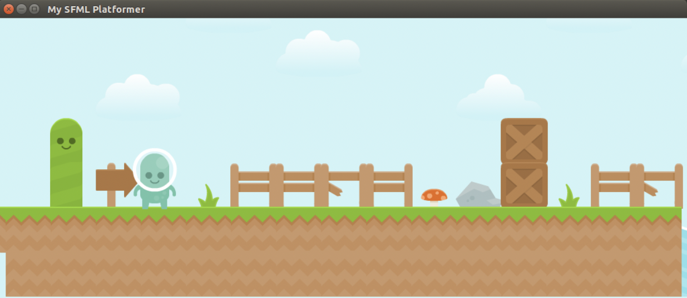
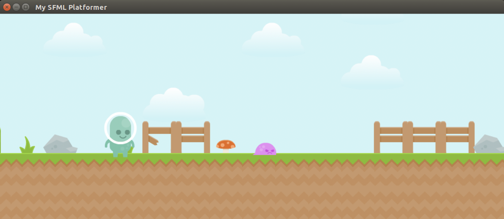
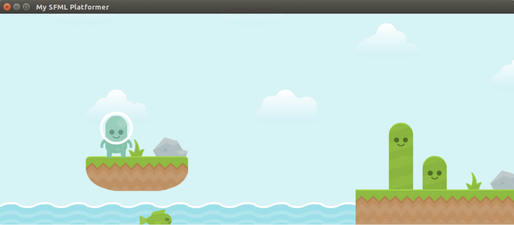
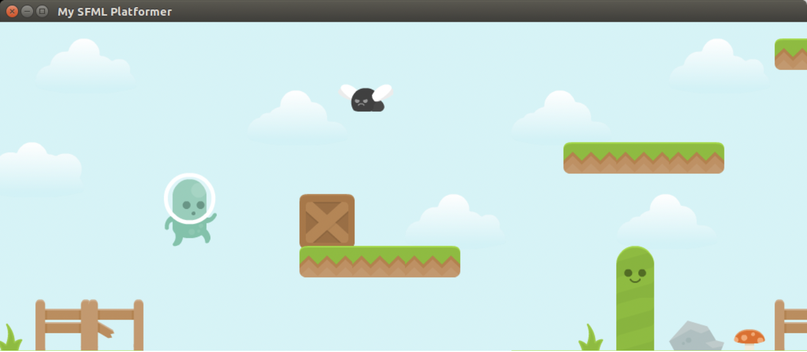
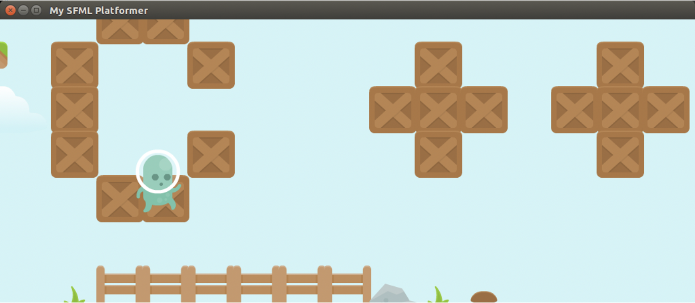

# SFML Game Platformer
This is a simple example of using SFML (Simple and Fast Multimedia Library) to create a 2D platform game.

SFML - https://www.sfml-dev.org/

Graphics - https://opengameart.org/ 

Screenshots:

